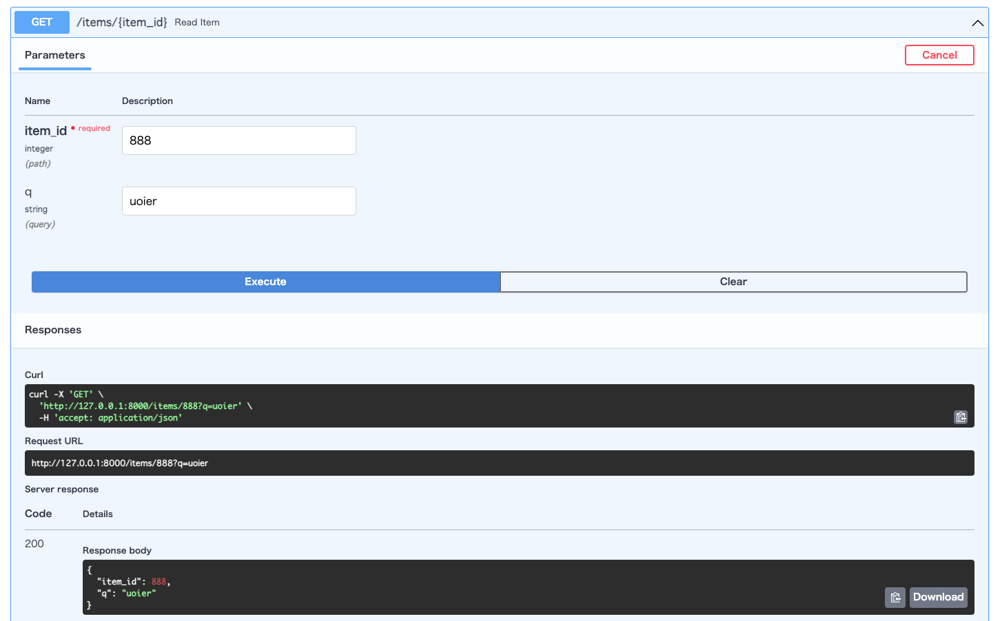

# fastapi_toy
## 目的
- Fast APIの試し利用とswaggerのテスト  
- RecBoleの推論用APIの作成

## FastAPIとswaggerのサンプルコード
`src/sample_app.py`を作成し、`uvicorn sample_app:app --reload`を実行するとAPIが立ち上がる。  
[http://127.0.0.0.1:8000/docs](http://127.0.0.0.1:8000/docs)　にアクセスすることでswaggerのドキュメントにアクセスできる。  

### swaggerの利用
上記URLでアクセス出来たら以下のような画面が出るため、各エンドポイントにパラメータを渡した時の実行結果確認などができる。

